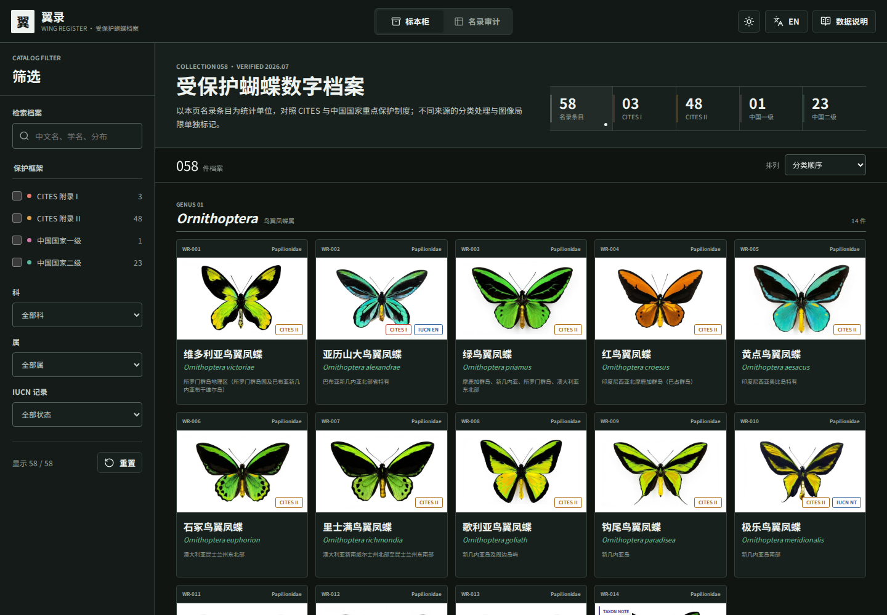

# 翼录

[English documentation](README_EN.md)

受保护蝴蝶数字档案，以标本柜浏览和名录对照两种视图呈现 58 个受保护蝴蝶名录条目。

- 中文在线访问：[seanwong17.github.io/butterfly-registry](https://seanwong17.github.io/butterfly-registry/)
- 英文在线访问：[seanwong17.github.io/butterfly-registry/?lang=en](https://seanwong17.github.io/butterfly-registry/?lang=en)



## 项目简介

翼录采用接近自然史馆藏的数字标本柜作为主要浏览界面，并提供紧凑的名录对照表。前者便于按形态、属级和分布快速浏览，后者用于集中核对 CITES、中国国家重点保护名录、IUCN 记录与不同来源的分类处理。

项目目前包含 58 个名录条目、58 张统一规格导览图，以及按保护框架、科、属、IUCN 记录进行组合筛选的完整交互。每条档案包括中文名、学名、命名人、分类路径、分布、形态说明、保护状态、名录备注和必要的分类口径说明。

## 功能

- 标本柜与名录对照双视图
- 保护框架、科、属和 IUCN 记录组合筛选，名录审计可单独查看需核对条目
- 中英文名称、学名、分布和说明全文检索
- 分类顺序、名称和保护优先级排序
- 58 条物种详情、前后条目导航及原图缩放查看
- 跟随系统偏好的浅色、深色界面切换并记忆选择
- 中文与英文完整 I18N 支持，语言选择可通过 URL 分享并在本地记忆
- 响应式桌面与移动端界面，无需构建步骤即可运行

## 数据范围与参考

页面统计单位是本项目中的 `rank=species` 名录条目，不代表全球全部受保护蝴蝶的独立物种总数。CITES 属级列名覆盖的条目按页面条目计数；当法定名录与分类数据库采用不同物种边界时，详情中保留相应处理说明。

非图像数据主要依据以下入口交叉核对：

- [CITES Checklist of Species](https://checklist.cites.org/)：核对附录等级、属级列名范围与公约采用的标准命名。
- [国家重点保护野生动物名录（2021）](https://www.gov.cn/zhengce/2021-02/05/content_5727412.htm)：核对中国国家一级、二级保护等级及法定名称。
- [GBIF Backbone Taxonomy](https://www.gbif.org/species/search)：核对接受名、异名、命名人和分类层级。
- [IUCN Red List](https://www.iucnredlist.org/)：核对页面中明确记录的受威胁等级与评估信息；空缺表示本页未记录，不等同于无危。
- [Species+](https://speciesplus.net/)：补充核对国际贸易管控、分布与分类概念。

现有导览图基于公开数据制作并统一处理，仅用于浏览展示。

欢迎通过 [GitHub Issues](https://github.com/SeanWong17/butterfly-registry/issues) 指出名称、分布、保护等级、分类或图像错误。

## I18N 与本地运行

默认语言为中文；点击页面右上角的语言按钮切换英文，也可直接访问英文地址：

```text
https://seanwong17.github.io/butterfly-registry/?lang=en
```

本地运行：

```bash
python3 -m http.server 4173
```

然后访问 `http://127.0.0.1:4173/`。运行数据与逻辑测试：

```bash
npm test
```

## 开源协议

本项目采用 [MIT License](LICENSE)。
